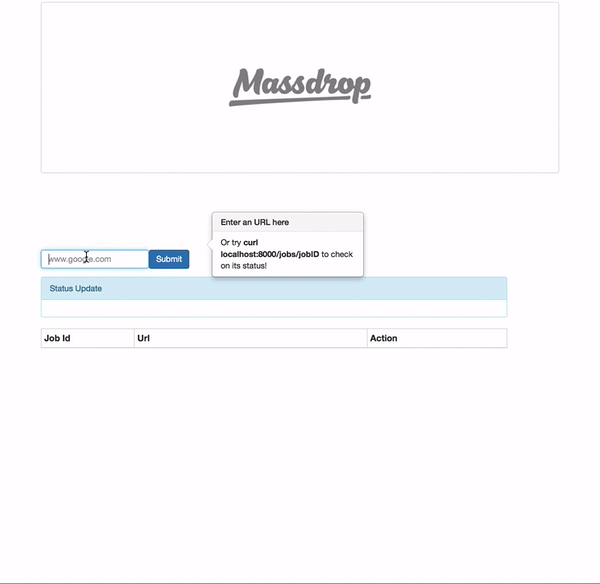

# Massdrop challenge
A Web crawler with a REST API interface that lets user add url to a queue as well as check its status.



## Goals
Give user the ability to put in URLs that are fetched periodically and saved to a DB. 

## Table of Contents

1. [Usage](#Usage)
1. [Requirements](#requirements)
1. [Development](#development)
    1. [Installing Dependencies](#installing-dependencies)
    1. [Tasks](#tasks)
1. [Roadmap](#roadmap)
1. [Contributing](#contributing)

## Usage

This repository is the source of truth for this application, used to:
 - Get a better understanding of underlying technologies that were used to build the application
 - Contribute to the project by openning pull request against the dev branch
 - Test existing APIs and components
 ### API
 Add an URL to the job queue
 ```
 curl --data "url=www.anysite.com" localhost:8000/jobs
 ```
 Get status of a job using a JobID
 ```
 curl localhost:8000/jobs/JobID
 ```
 Get the HTML of a retrived site using its JobID
 ```
 curl localhost:8000/redirect/JobID
 ```
 Change frequency that worker wakes up and fetches html 
 (Default at 10000 ms)
 ```
 curl --data "freq=30000" localhost:8000/worker
 ```

## Technologies

### Frontend
- React (ES6)
- React Router
- Simple Boostrap UI


### Backend
- Node
- Express
- Redis

## Requirements

- Node 6.4 and up
- React 15.0 and up
- Redis 2.8 and up


## Setup

From within the root directory:
clone down the repo
```
git clone https://github.com/tungnh91/massdrop-challenge.git
```
cd to the root directory of the project
```
cd ./massdrop-challenge
```
install dependencies
```
npm install
```
start database
```
redis-server
```
Note: if this fails, troubleshoot at ``` https://redis.io/topics/quickstart ```

precompile assets
```
npm run build
```
start server for development
```
npm run start
```
start production server 
```
npm run serve
```
start hacking!


### Roadmap

- Implement authentication to give out dev key (limit api usage, prevent attacks).
- Implement hash table to look up job ID with a shorter, user-customizable key.
- Deploy to DigitalOcean / Heroku to demo for proof of concept.

## Contributing

See [CONTRIBUTING.md](CONTRIBUTING.md) for contribution guidelines.
